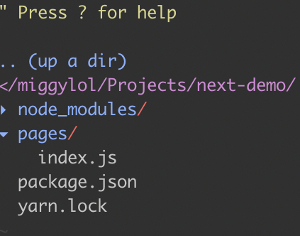

> Hey man, so i keep hearing about this library called React. What can you tell me about?

If you are more of a docs kinda gal/guy, here is the [GitHub Repo](https://github.com/facebook/react) for it.
Otherwise, let me tell you a story about React and why I started using it

#### "It all started when I used Angular..."

So yes, I used Angular 2.0 first. It was my first exposure to a web framework. Angular (and Vue) and React all do basically the same thing.
They all allow you to make Lego blocks out of your User Interface. These Lego blocks allow you to build up your UI using small styled pieces of code
that all work together to build your app.

Angular was nice since I had so much better control of the web page compared to JQuery/Vanilla JS. I could
add cool events to elements on the page in a much cleaner way. I could also create Lego blocks (which we will now call **Components**) from the command line. It let me build quickly
and in an organized fashion.

> Okay, but I clicked this link so that I can learn about React. What gives!?

I'm getting there! Don't worry!

#### Why Angular made me choose React

So I soon learned to hate creating components in the command line. I didn't enjoy using having to `ng generate <name of component> <path to module>`
for every single component I wanted to create. And then after that, I had to deal with all of the **boilerplate**
that came with Angular.

There was so much weird stuff like making sure your component was connected to your module
and that your imports had to occur in order? That's so unneccessary. I say unneccessary because React and Vue **don't need that** to work.

There was also this thing called dependency injection where you sort of "inject" logic into your components?
I mostly blame my lack of Object Oriented knowledge to why this pattern frustrated me. To others this is a cool
feature, but to me, it was just confusing.

#### Boilerplate and code that I didn't care to learn

Take a look at this file structure for the project stucture of a hello world app. Creds to [codeburst](https://codeburst.io/angularjs-4-101-6675076784aa)


Take a look at NextJS's file structure for a hello world project.


It's so much smaller and easier to understand and get started with for Single Page Apps
I always believe that less code is the best code and React takes the cake on this one

> Oooooooo fancy! But how is it like working on an actual app?

I don't want to make this a tutorial on how to build React apps. Instead I will go over project structure and
development concepts like testing.

Testing in React is basically testing a function. React components are typically
functions and Angular Components are all classes. The test suites for Angular are very verbose and all over the place.
Personally, I just get scared when I see blobs of code that I cannot read. There are a bunch of imports and TestBed
objects that I have no idea how to use. As a developer I want to write the minimal, acceptable amount of
tests and spend most of my time fixing or writing new features. User's want cool features, not a crazy test suite.
Let's not get too lost in the test. For those who are looking for an awesome testing library checkout [`react-testing-library`](https://github.com/kentcdodds/react-testing-library).

In React, I test it like I would test a JavaScript function. No TestBed, just a single import of the component and run it
and see if everything shows up properly. Check this out...

```jsx
import React from 'react'
import FooterTop from 'pages/Footer/FooterTop'
import { expect } from 'chai'
import { cleanup, act } from 'react-testing-library'
import { renderComponent } from './utils'

afterEach(cleanup)

test('should only show the Contact Us section on mobile devices and will show everything when not on mobile, even when resizing', () => {
  window.innerWidth = 599
  const { queryByText, rerender, getByText } = renderComponent(<FooterTop />)
  const contactUs = queryByText('CONTACT US')
  const about = queryByText('ABOUT')
  const links = queryByText('LINKS')

  expect(contactUs).to.exist
  expect(about).not.to.exist
  expect(links).not.to.exist

  act(() => {
    window.innerWidth = 601
    window.dispatchEvent(new Event('resize'))
  })

  rerender(<FooterTop />)

  getByText('CONTACT US')
  getByText('ABOUT')
  getByText('LINKS')
})
```


I didn't need to build a test bed, inject dependenies or anything like that.

Writing code is quite nice. The only part that I kind of copy and paste is...

```jsx
import React from 'react'

export default function NewComponent(props) {
  return <h1>NewComponent<h1>
}
```

Considering I only have 4 lines of boilerplate per basic component (obviously your milage will vary),
I think that's pretty good.

> What if I need components that share some of the same of the same logic?

So I think what you are asking is if we had two similar components in terms of logic, but render
different UI. Maybe your Home Page has to prefetch data and so does your Auth Page. In 2019, React
released 16.8 which includes a stable implementation of React Hooks. Hooks are like functions that
you add on to your components.

This is **NOT INHERITANCE**. Hooks can be added to any component that needs
them. Here is where class components in Angular and even React will really fall short.
If you want to share functionality between class components, you would have to copy and paste
the code since we also need to handle functionality in the [component lifecyle](https://reactjs.org/docs/state-and-lifecycle.html).

Altogether, I think React has great tools to share logic and UI between different components
which make it a lot easier to write than other frameworks.

> Don't more people use Angular thought?

Doesn't React have triple the amount of stars on Github? A lot of people us React becuase it is easy to use, even more so
now that React Hooks are stable. Functions are just fundamentally simpler that classes. Simplicity is what I am looking
for in development.

I have met double the amount of React developers than I have Angular developers so far. Angular is used
a lot in industry, but that is because Angular **works** and it is older. So more people adopted it and there is no
reason for a migration since Angular **works** for them.

> Any other things about React I should know?

**Now** is a great time to get started on React. React Hooks changed the way we write React code and it has never
been so much cleaner to write and easier to read. I love the simplicity of the code. I love how easy it is to test.
I love how much community support it has an the amount of people using it now. I hope this blog inspires you to learn React
or at the very least give you an idea of why React is the better choice.

#### Last Note
On a serious note, make sure you can truly justify using React. If you have a bunch of Angular or Vue
gurus and need an app built in 2 weeks, don't have them learn a new library just because. **ALWAYS REMEMBER**
that your users **DO NOT CARE AT ALL** what you used to build your app.

They want features, speed and ease of use. Choose your framework that suites your team. If you can (somehow)
build components faster in Angular than you can in React or do not have the time to learn React, then don't learn
React. If it is mission-critical that you get this app built in 2 weeks, prioritize your time.

